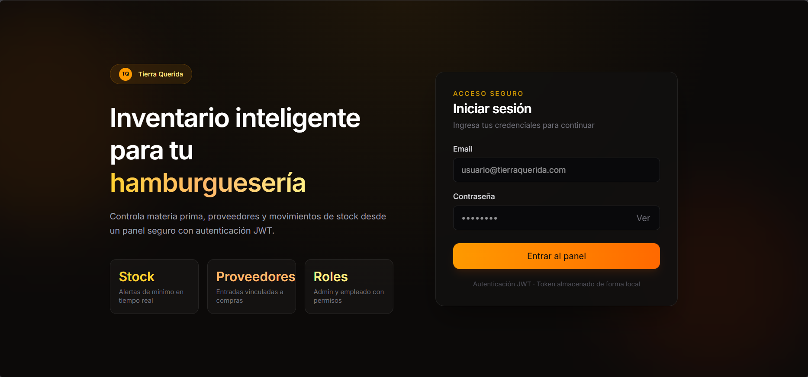
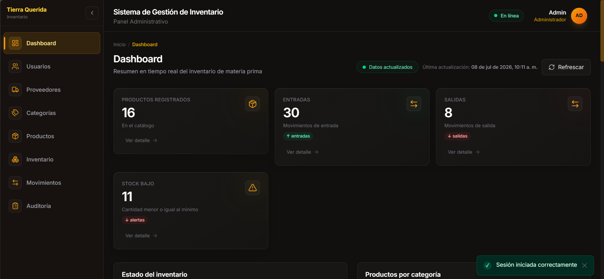
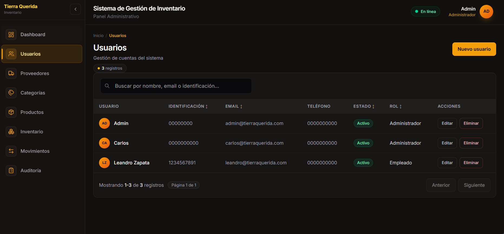
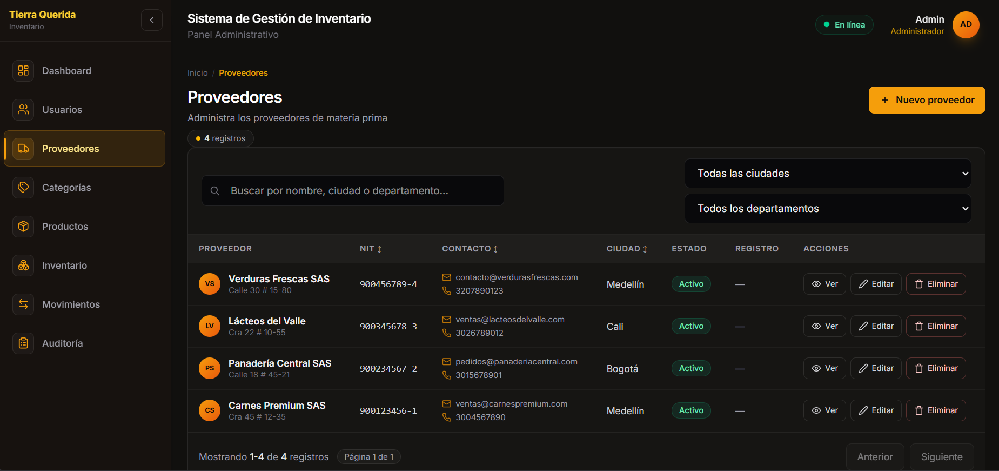
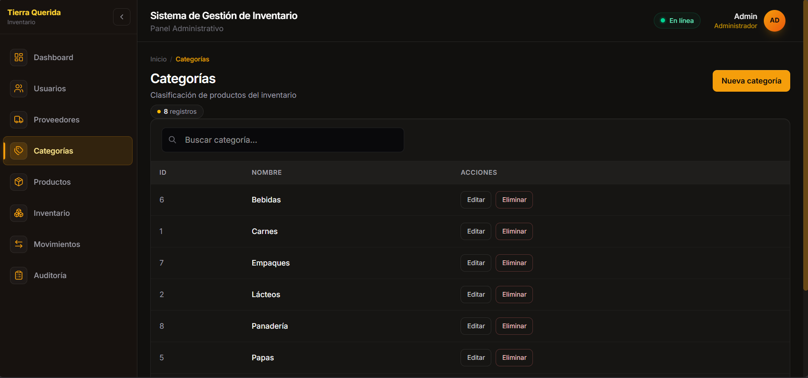
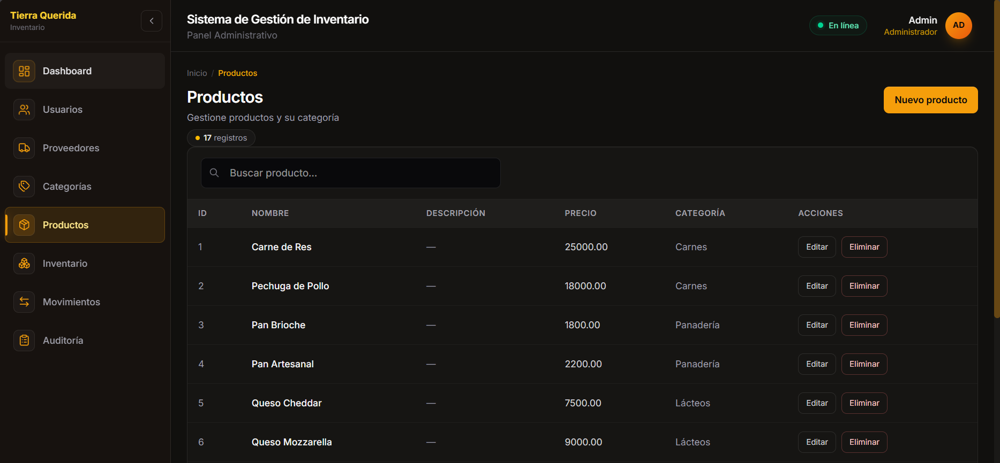
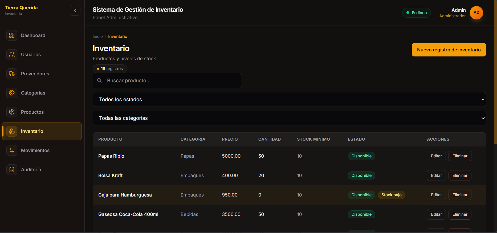
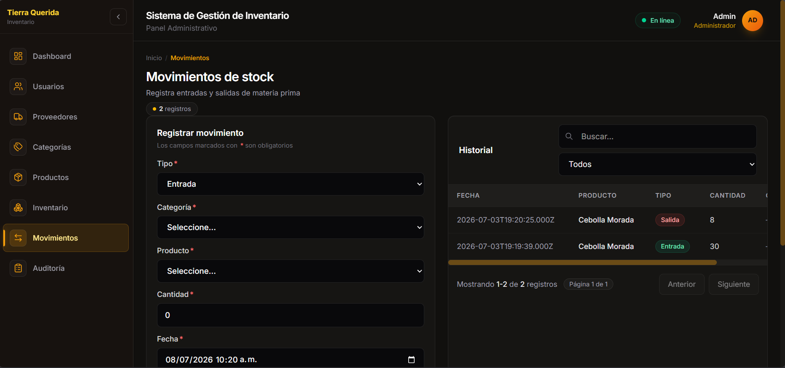
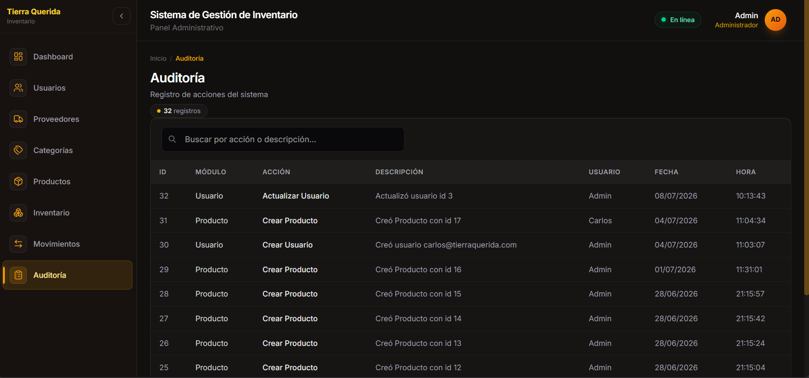

# Tierra Querida

Sistema web de gestion de inventario orientado al control operativo de materia prima, abastecimiento y trazabilidad interna. El proyecto integra un frontend SPA y una API REST con autenticacion JWT, control por roles y registro de auditoria para operaciones criticas.

------------------------------------------------

## Características

- Dashboard
- Gestión de usuarios
- Gestión de proveedores
- Gestión de categorías
- Gestión de productos
- Gestión de inventario
- Movimientos de entrada
- Movimientos de salida
- Auditoría
- Roles
- Autenticación JWT

------------------------------------------------

## Tecnologías

### Frontend

- Angular
- TypeScript
- TailwindCSS

### Backend

- Node.js
- Express

### Base de datos

- MySQL / MariaDB

### Seguridad

- JWT
- bcrypt

------------------------------------------------

## Estructura del proyecto

```text
tierraQueridaProject/
|- backend/
|  `- src/
|- frontend/
|  `- src/
|- docs/
|  |- ManualUsuario.md
|  |- ManualTecnico.md
|  |- Arquitectura.md
|  |- Api.md
|  |- EstructuraProyecto.md
|  |- BuenasPracticas.md
|  `- Database.md
|- database.sql
|- README.md
|- CHANGELOG.md
`- LICENSE
```

------------------------------------------------

## Instalación

### Backend

```bash
cd backend
npm install
```

```bash
cd backend
npm run dev
```

### Frontend

```bash
cd frontend
npm install
```

```bash
cd frontend
ng serve
```

### Variables de entorno

Crear el archivo `.env` en `backend/`:

```env
PORT=3000
NODE_ENV=development
CORS_ORIGIN=*

DB_HOST=localhost
DB_PORT=3306
DB_USER=root
DB_PASSWORD=
DB_NAME=tierraQuerida_db
DB_CONNECTION_LIMIT=10

JWT_SECRET=cambia_este_secreto_en_produccion
JWT_EXPIRES_IN=8h
BCRYPT_SALT_ROUNDS=10
```

------------------------------------------------

## Documentación

- [Manual de Usuario](docs/ManualUsuario.md)
- [Manual Técnico](docs/ManualTecnico.md)
- [Arquitectura](docs/Arquitectura.md)
- [API](docs/Api.md)
- [Estructura del Proyecto](docs/EstructuraProyecto.md)
- [Buenas Prácticas](docs/BuenasPracticas.md)
- [Base de Datos](docs/Database.md)

------------------------------------------------

## Capturas

<!-- Dashboard -->
<!-- Usuarios -->
<!-- Proveedores -->
<!-- Categorías -->
<!-- Productos -->
<!-- Inventario -->
<!-- Movimientos -->
<!-- Auditoría -->

## Login



-----------------------------------------------------

## Dashboard



-----------------------------------------------------

## Usuarios



-----------------------------------------------------

## Proveedores



-----------------------------------------------------

## Categorías



-----------------------------------------------------

## Productos



-----------------------------------------------------

## Inventario



-----------------------------------------------------

## Movimientos



-----------------------------------------------------

## Auditoría



------------------------------------------------

## Base de datos

- `docs/Database.md` contiene la documentación técnica del esquema.
- `database.sql` contiene el script completo para crear la base de datos.

------------------------------------------------

## Autor

David Steven Mosquera Hillón

Proyecto desarrollado para el SENA.

------------------------------------------------

## Licencia

MIT
