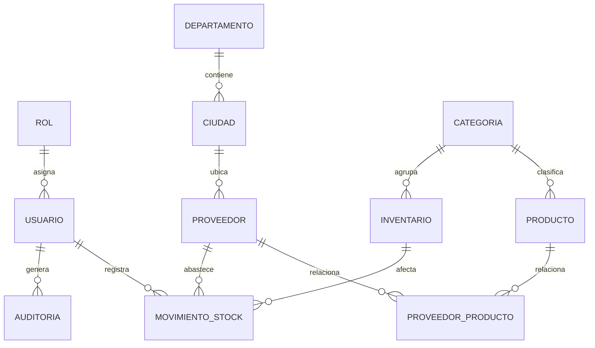

# Base de datos `tierraquerida_db`

Documento de referencia construido a partir del dump SQL real de la base de datos. Resume la estructura, relaciones, índices y datos semilla para que el esquema se vea completo en GitHub.

## Resumen general

- Motor principal: MariaDB / MySQL
- Codificación: `utf8mb4`
- Tablas principales: `rol`, `usuario`, `departamento`, `ciudad`, `proveedor`, `categoria`, `producto`, `inventario`, `movimiento_stock`, `auditoria`, `proveedor_producto`
- Relación central: catálogo de productos e inventario con trazabilidad por movimientos de stock y auditoría

## Diagrama ER

## Tablas

### `rol`

Catálogo de roles del sistema.

| Campo | Tipo | Nulo | Clave | Descripción |
| --- | --- | --- | --- | --- |
| `id_rol` | int(11) | No | PK, AI | Identificador del rol |
| `nombre_rol` | varchar(50) | No | UNIQUE | Nombre del rol |
| `descripcion` | varchar(150) | Sí |  | Descripción del rol |

Índices y restricciones:
- `UNIQUE KEY nombre_rol`

Datos semilla:
- `Administrador`
- `Empleado`

### `usuario`

Usuarios autenticables del sistema.

| Campo | Tipo | Nulo | Clave | Descripción |
| --- | --- | --- | --- | --- |
| `id_usuario` | int(11) | No | PK, AI | Identificador del usuario |
| `identificacion` | varchar(20) | No | UNIQUE | Documento de identidad |
| `nombre` | varchar(100) | No |  | Nombre completo |
| `email` | varchar(100) | No | UNIQUE | Correo electrónico |
| `clave` | varchar(255) | No |  | Hash de contraseña |
| `telefono` | varchar(15) | Sí |  | Teléfono |
| `estado` | enum('Activo','Inactivo') | Sí |  | Estado del usuario |
| `fecha_creacion` | datetime | Sí |  | Fecha de creación |
| `id_rol` | int(11) | No | FK | Rol asignado |

Restricciones:
- `FOREIGN KEY (id_rol) REFERENCES rol(id_rol)`

Índices:
- `UNIQUE KEY identificacion`
- `UNIQUE KEY email`
- `KEY id_rol`

### `departamento`

Catálogo geográfico de departamentos.

| Campo | Tipo | Nulo | Clave | Descripción |
| --- | --- | --- | --- | --- |
| `id_dpto` | int(11) | No | PK, AI | Identificador del departamento |
| `nombre` | varchar(100) | No |  | Nombre del departamento |

Datos semilla:
- Antioquia
- Cundinamarca
- Valle del Cauca
- Atlántico
- Santander

### `ciudad`

Ciudades asociadas a un departamento.

| Campo | Tipo | Nulo | Clave | Descripción |
| --- | --- | --- | --- | --- |
| `id_ciudad` | int(11) | No | PK, AI | Identificador de la ciudad |
| `nombre` | varchar(100) | No |  | Nombre de la ciudad |
| `id_dpto` | int(11) | No | FK | Departamento asociado |

Restricciones:
- `FOREIGN KEY (id_dpto) REFERENCES departamento(id_dpto)`

Índices:
- `KEY id_dpto`

### `proveedor`

Proveedores registrados en el sistema.

| Campo | Tipo | Nulo | Clave | Descripción |
| --- | --- | --- | --- | --- |
| `id_proveedor` | int(11) | No | PK, AI | Identificador del proveedor |
| `nit` | varchar(20) | No | UNIQUE | NIT |
| `razon_social` | varchar(100) | No |  | Razón social |
| `direccion` | varchar(150) | Sí |  | Dirección |
| `email` | varchar(100) | Sí |  | Correo |
| `telefono` | varchar(15) | Sí |  | Teléfono |
| `id_ciudad` | int(11) | No | FK | Ciudad asociada |

Restricciones:
- `FOREIGN KEY (id_ciudad) REFERENCES ciudad(id_ciudad)`

Índices:
- `UNIQUE KEY nit`
- `KEY id_ciudad`

Datos semilla:
- Carnes Premium SAS
- Panadería Central SAS
- Lácteos del Valle
- Verduras Frescas SAS

### `categoria`

Clasificación de productos e inventario.

| Campo | Tipo | Nulo | Clave | Descripción |
| --- | --- | --- | --- | --- |
| `id_categoria` | int(11) | No | PK, AI | Identificador de la categoría |
| `nombre_categoria` | varchar(50) | No | UNIQUE | Nombre de la categoría |

Datos semilla:
- Carnes
- Lácteos
- Verduras
- Salsas
- Papas
- Bebidas
- Empaques
- Panadería

### `producto`

Catálogo maestro de productos.

| Campo | Tipo | Nulo | Clave | Descripción |
| --- | --- | --- | --- | --- |
| `id_producto` | int(11) | No | PK, AI | Identificador del producto |
| `nombre` | varchar(150) | Sí | IDX | Nombre del producto |
| `descripcion` | varchar(255) | Sí |  | Descripción |
| `precio_unitario` | decimal(10,2) | Sí |  | Precio unitario |
| `id_categoria` | int(11) | No | FK, IDX | Categoría asociada |
| `created_at` | datetime | Sí |  | Fecha de creación |
| `updated_at` | datetime | Sí |  | Fecha de actualización |

Restricciones:
- `FOREIGN KEY (id_categoria) REFERENCES categoria(id_categoria) ON UPDATE CASCADE`

Índices:
- `KEY idx_producto_categoria`
- `KEY idx_producto_nombre`

### `inventario`

Existencias operativas de productos.

| Campo | Tipo | Nulo | Clave | Descripción |
| --- | --- | --- | --- | --- |
| `id_inventario` | int(11) | No | PK, AI | Identificador del registro de inventario |
| `producto` | varchar(100) | Sí |  | Nombre del producto asociado |
| `cantidad` | int(11) | No |  | Cantidad disponible |
| `stock_minimo` | int(11) | No |  | Umbral mínimo |
| `unidad_medida` | varchar(20) | Sí |  | Unidad de medida |
| `precio_unitario` | decimal(10,2) | Sí |  | Precio unitario |
| `estado` | enum('Disponible','Agotado') | Sí |  | Estado del inventario |
| `fecha_registro` | datetime | Sí |  | Fecha de registro |
| `id_categoria` | int(11) | No | FK, IDX | Categoría del inventario |
| `id_producto` | int(11) | Sí |  | Referencia auxiliar al producto |

Restricciones:
- `FOREIGN KEY (id_categoria) REFERENCES categoria(id_categoria)`

Índices:
- `KEY id_categoria`

### `movimiento_stock`

Historial de entradas y salidas de inventario.

| Campo | Tipo | Nulo | Clave | Descripción |
| --- | --- | --- | --- | --- |
| `id_movimiento` | int(11) | No | PK, AI | Identificador del movimiento |
| `tipo_movimiento` | enum('Entrada','Salida') | No |  | Tipo de movimiento |
| `cantidad` | int(11) | No |  | Cantidad movida |
| `fecha_movimiento` | datetime | Sí |  | Fecha del movimiento |
| `observacion` | varchar(255) | Sí |  | Observación |
| `id_usuario` | int(11) | No | FK | Usuario que registró |
| `id_proveedor` | int(11) | Sí | FK | Proveedor asociado |
| `id_inventario` | int(11) | No | FK | Inventario afectado |

Restricciones:
- `FOREIGN KEY (id_usuario) REFERENCES usuario(id_usuario)`
- `FOREIGN KEY (id_proveedor) REFERENCES proveedor(id_proveedor)`
- `FOREIGN KEY (id_inventario) REFERENCES inventario(id_inventario)`

Índices:
- `KEY id_usuario`
- `KEY id_proveedor`
- `KEY id_inventario`

Datos semilla:
- 1 movimiento de entrada
- 1 movimiento de salida

### `auditoria`

Registro de acciones del sistema.

| Campo | Tipo | Nulo | Clave | Descripción |
| --- | --- | --- | --- | --- |
| `id_auditoria` | int(11) | No | PK, AI | Identificador de auditoría |
| `accion` | varchar(100) | No | IDX | Acción realizada |
| `descripcion` | varchar(255) | Sí |  | Detalle de la acción |
| `fecha` | datetime | Sí | IDX | Fecha del evento |
| `id_usuario` | int(11) | Sí | FK, IDX | Usuario responsable |

Restricciones:
- `FOREIGN KEY (id_usuario) REFERENCES usuario(id_usuario) ON DELETE SET NULL ON UPDATE CASCADE`

Índices:
- `KEY idx_auditoria_fecha`
- `KEY idx_auditoria_accion`
- `KEY idx_auditoria_usuario`

Datos semilla:
- Registros de creación y actualización de usuarios, categorías, proveedores, productos e inventario

### `proveedor_producto`

Tabla puente muchos-a-muchos entre proveedores y productos.

| Campo | Tipo | Nulo | Clave | Descripción |
| --- | --- | --- | --- | --- |
| `id_proveedor` | int(11) | No | PK, FK | Proveedor |
| `id_producto` | int(11) | No | PK, FK | Producto |
| `created_at` | datetime | Sí |  | Fecha de asociación |

Restricciones:
- `FOREIGN KEY (id_producto) REFERENCES producto(id_producto) ON DELETE CASCADE ON UPDATE CASCADE`
- `FOREIGN KEY (id_proveedor) REFERENCES proveedor(id_proveedor) ON DELETE CASCADE ON UPDATE CASCADE`

Índices:
- `KEY idx_pp_producto`

## Relaciones clave

- Un `rol` puede tener muchos `usuario`
- Un `departamento` puede tener muchas `ciudad`
- Una `ciudad` puede tener muchos `proveedor`
- Una `categoria` puede tener muchos `producto`
- Una `categoria` puede tener muchos registros en `inventario`
- Un `usuario` puede registrar muchos `movimiento_stock`
- Un `proveedor` puede aparecer en muchos `movimiento_stock`
- Un `inventario` puede tener muchos `movimiento_stock`
- Un `usuario` puede generar muchos registros en `auditoria`
- `proveedor_producto` resuelve la relación muchos-a-muchos entre proveedores y productos

## Observaciones del dump

- La base ya contiene datos semilla para roles, usuarios, departamentos, ciudades, proveedores, categorías, productos, inventario, movimientos y auditoría.
- La tabla `proveedor_producto` existe como estructura, pero no tiene registros cargados en el dump.
- `inventario` conserva un campo `producto` textual además de `id_producto` opcional, lo que refleja el diseño actual del proyecto.

## Nota

Si quieres, el siguiente paso puede ser incrustar también el SQL completo al final del documento o generar un ERD más detallado por módulo.